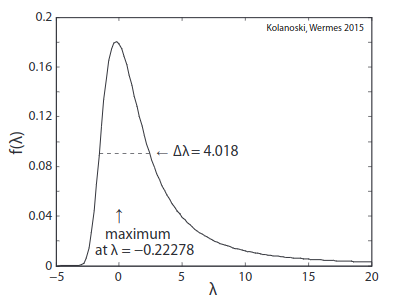
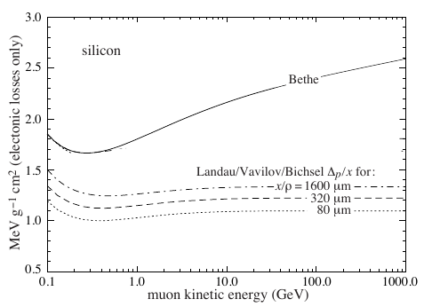

[TOC]

------

# Interazione radiazione materia

Il tempo tipico di decadimento delle particelle dipende dal tipo di interazione:

- Forte  < $10^{-22}s$
- Debole > $10^{-13}s$
- EM $10^{-20}-10^{-14}s$

La lunghezza percorsa da una particella prima di decadere è $l=\beta \gamma c \tau_0$ quindi possono essere misurate direttamente protoni, neutroni, elettroni,neutrini (elusivi) e muoni. I $\pi$ e i K possono essere rivelati direttamente ma anche decadere nel rivelatore.

**Proprietà misurabili**:

- **Momento**: per particelle cariche misurabile tramite il raggio di curvatura in campo magnetico $$p=qRB$$ (R ha un segno per essere consistente con la direzione e con la carica)
- **Carica**: Dirzione della deflessione in campo magnetico
- **Energia**: Misurabile tramite la carica rilasciata o la luce prodotta in un calorimetro
- **Tempo di vita**: Ricostruendo il vertice del decadimento (geometricamente) si può ricavare il tempo in cui è decaduta
- **Velocità**: Tramite TOF, angolo Cherenkov o dal $\frac{dE}{dx}$ 
- **Massa**: Ottenibile da $m^2=E^2-p^2$ o da $p=m\beta/\sqrt{1-\beta^2} $

------

## Interazione di particelle cariche

I meccanismi di interazione principali per le particelle cariche sono:

- **Eccitazione/Ionizzazione**: Un atomo viene ionizzato rilasciando un $e^-$ poi collezionato per formare un segnale o viene prodotta luce tramite de eccitazione

- **Bremstrahlung**: Particella che viene deflessa dal campo EM nucleare e irraggia (*significativa solo per $e^+$ ed $e^{-}$: particelle leggere*)

- **Cherenkov**: Onda d'urto EM prodotta da particelle veloci

- **Radiazione di transizione**: Radiazione emessa quando una particella attraversa un mezzo con indice di rifrazione discontinuo (es. separazione tra vuoto e dielettrico). Questo accade perchè il campo elettrico longitudinale subisce un brusco riarrangiamento che ,in situazioni di energie molto alte, causa irraggiamento

  L'intensità della radiazione è $\propto \gamma$ quindi può essere usata per misurare velocità

### Particelle massive

#### Stopping power

Lo stopping power è definito come il $-dE/dx$ per unità di densità del materiale quindi è misurata in $MeV cm^2/g$  ed è espresso in funzione di $\beta \gamma=p/m$.

Queste curve, se non normalizzate per la massa della particella, possono essere utili per fare particle identification poichè ogni particella segue una curva a se

|  |
| :----------------------------------------------------------: |
| Plot dello stopping power **per particelle con $M>>m_e$** . Per elettroni e positroni domina Bremstrahlung.  Possiamo distinguere 3 zone :  zona di scattering elastico, di ionizzazione e di Bremstrahlung |

Analizziamo le diverse regioni della curva:

- Nella zona a più bassa energia (Lindhard-Scharff) si ha un andamento $\propto \beta$ dovuto a scattering elastico su nuclei

- La zona di Anderson-Ziegler è ottenuta empiricamente tramite fit su dati sperimentali per mettere un raccordo tra i modelli

  In questa zona si ha l' **effetto Barkas** che consiste in un minore stopping power per particelle negative (dovuto a fattori correttivi di ordine successivo)

- Nella zona di ionizzazione a basse energie si ha un andamento dominato da un fattore cinematico $\sim \beta^{-5/3} \sim \beta^{-2}$ 

  In questa zona la curva è molto sensibile a variazioni di $\beta$ quindi è possibile ricavare la velocità misurando il $dE/dx$

- A circa 3 - 4$\beta \gamma$ si ha il minimo di ionizzazione ed è $\sim 1-2 MeV cm^2/g$

- Dopo il minimo di ionizzazione si ha una risalita $\propto ln(\beta \gamma)^2$ dovuta all'estensione relativistica del campo elettrico trasversale ma per grandi $\beta \gamma$ il dielettrico viene polarizzato e si ha una saturazione (*effetto del $\delta$*)

- Al di sopra dell' **energia critica** dominano le perdite radiative ovvero la Bremstrahlung e altri processi minori

Concentriamoci un attimo sulle perdite per **ionizzazione**

|  |
| ------------------------------------------------------------ |
| Bethe-Block: dE/dx dovuta unicamente alla ionizzazione (zona centrale dello stopping power) (e alla radiazione Cherenkov). Non include nè le perdite per bremstrahlung (dominante ad alte energie) nè le perdite per radiazione di transizione |

|  |
| :----------------------------------------------------------: |
| A: Possiamo vedere come le curve sono essenzialmente indipendenti dal materiale salvo per l'idrogeno. Ricorda che sono normalizzate per la densità |
| B: Qui è possibile vedere meglio l'effetto del termine $\delta$ e della dipendenza logaritmica |

Alcune osservazioni sulla Bethe-Block (ionizzazione):

- il fattore Z/A, per la formula semiempirica di massa, è più o meno sempre lo stesso $Z/A\sim 0.4$ tranne che per l'idrogeno $H_2$ dove è 1 (poichè non ha neutroni)
- A basse energie domina andamento $\sim \beta^{-2}$. 
- La curva poi risale per 2 motivi: 
  1. La massima energia trasferibile aumenta con $ \gamma$ (effetto cinematico)
  2. Il campo elettrico trasversale subisce un estensione per effetti relativistici anche se limitato dallo screening degli elettroni atomici che vengono polarizzati (termine $\delta$)

#### Picco di Bragg

Per particelle massive con momenti molto bassi si può osservare il picco di Bragg

| La dose non è altro che E/M |
| :----------------------------------------------------------: |
| Man mano che la particella perde energia lo stopping power aumenta. E' possibile ricostruire l'energia persa in funzione della penetrazione usando l'andamento $\beta^{-2}$ valido a basse energie |

#### Elettroni delta

Per trasferimenti di energia elevati possono essere strappati elettroni atomici che creano tracce secondarie (sufficientemente lunghe) nella stessa direzione della particella incidente (o comunque a piccoli angoli).

Se il detector non riesce a trattare adeguatamente questi elettroni si può avere un peggioramento della risoluzione spaziale (poichè la carica viene depositata più lontano dal punto di interazione) e fluttuazioni più grandi dello stopping power

#### Range

Il range è la lunghezza percorsa dalla particella nel materiale $R=\int_{T_0}^0 (\frac{dE}{dx})^{-1} dT$ dove $T_0$ è l'energia cinetica iniziale della particella.

|  |
| :----------------------------------------------------------: |

Quando sono coinvolti fenomeni di assorbimento il numero di particelle decresce esponenzialmente (fotoni).

Quando sono coinvolte particelle cariche il numero di particelle rimane pressocchè costante. In figura si vede una lieve diminuzione dovuta a interazioni nucleari.

Si nota anche che il $dN/dx$​ non è una delta ma ha una sua larghezza chiamata **straggling** : questo fenomeno è dovuto alle fluttuazioni statistiche dell'energia rilasciata nel materiale (vedi più avanti)

|  |
| :----------------------------------------------------------: |
| Range normalizzato per la densità del materiale in funzione di $\beta \gamma$ . Plot utile per capire quanto materiale usare in un esperimento |

Se si esprime l'integrale del range in funzione di $\gamma$ si ha $R=\frac{M}{z^2}f(\gamma_0)$ dove $\gamma_0$ è il $\gamma$ iniziale della particella e $f(\gamma_0)$ è una funzione indipendente dalle proprietà della particella (massa e carica) e dipende solo dal materiale. Quindi il range scala come $M/z^2$ (riferite alla particella)

------

### Particelle poco massive ($e^-$ ed $e^+$)

Per le particelle cariche poco massive (elettroni e positroni) vale quanto detto sopra ma sono presenti dei fenomeni aggiuntivi: 

- La **bremstrahlug**  
- Gli elettroni incidenti scatterano con elettroni atomici: Sono particelle identiche, interviene il principio di pauli
- Per positroni va considerata l'annichilazione con gli elettroni atomici

Generalmente, oltre a prendere in considerazione la bremstrahlung, vanno considerati 2 regimi di energia:

- Quando i livelli energetici degli elettroni atomici NON possono essere trascurati si fa la media come nel caso di particelle massive
- Quando si hanno grandi trasferimenti di energia vengono considerati gli scattering Moller ($e^- e^- \to e^- e^-$) e Bhabha ($e^+ e^- \to e^+ e^-$)  

|  |
| :----------------------------------------------------------: |
| Per particelle leggere il dE/dx è molto diverso in quanto la bremmstrahlung diventa dominante già sotto il GeV, nel piombo già a 7MeV  Anche qui si nota l'effetto per il quale la particella con carica negativa a basse energie perde un po' meno energia |

#### Bremstrahlung e lunghezza di radiazione

Consiste nell'irragiamento dovuto alla deflessione dell'elettrone causata dal campo elettrico nucleare (scattering Rutherford con il nucleo)

L'energia emessa per una carica accelerata, sia nel limite classico che quantistico, è $dE/dt \propto \frac{1}{m^2}$

> **NB** Ad altissime energie (es. LHC) la bremmstrahlung diventa rilevante anche per muoni e pioni

$$
-\frac{dE}{dX}|_{\text{Brem.}}= \frac{E}{X_0} \implies
\\
\implies E(x)=E_0 e^{-x/X_0}
$$

|  |
| :----------------------------------------------------------: |
| $X_0$ è chiamata **lunghezza di radiazione** e corrispone alla lunghezza dopo il quale l'energia di un **elettrone** è ridotta di un frattore $1/e$ (per bremmstrahlung) |
| **NB** La lungheza di radiazione è definita solo per elettroni in quanto per altre particelle molto energetiche come muoni le fluttuazioni di energia sono molto grandi e spesso sono associate a sciamature quindi parlare di perdita di energia come un processo uniforme e continuo è insensato |

> Si noti la dipendenza (molto approssimativa a causa del log.) $-\frac{dE}{dx} \sim \propto E Z^2$ 

Tipicamente la Bremmstrahlung viene emessa in avanti o comunque a piccoli angoli $\theta \sim1/\gamma=m/E$

|  |
| ------------------------------------------------------------ |
| A: Spettro della Bremmstrahlung per C e Pb normalizzata per fattore $E_\gamma/Z^2$ |
| B,C: distribuzione angolare della Bremmstrahlung a diverse energie |

Inoltre quando avviene Bremmstrahlung dobbiamo considerare vari possibili fenomeni:

- Correzioni di Coulomb: Correzione dovuta all'interferenza della funzione d'onda della particella con il campo coulombiano

- Suppressione dielettrica: Fotoni emessi a piccole energie vengono assorbiti nel materiali a causa della polarizzabilità del materiale causando una perdita di coerenza e un cutoff infrarosso nello spettro del fotone

- La bremmstrahlung può avvenire anche con il campo elettrico degli elettroni atomici (basta sostituzione $Z^2 \to Z(Z+1)$)

- Effetto LPM: Ad altissime energie (sopra il TeV) la Bremmstrahlung (e la produzione di coppie) è soppressa .

  Ad alte energie per energie perse piccole l'interazzione avviene su lunghe distanze. Se questa distanza è maggiore del cammino libero medio (distanza media tra 2 eventi successivi) la prima emissione interferisce con la seconda introducendo causando una soppressione nello spettro dei fotoni

------

###  Fluttuazioni statistiche

La Bethe block determina solo il $dE/dx$ medio ma in realtà l'energia rilasciata è soggetta a fluttuazioni.

L'energia persa $\Delta E$ in un tratto $\Delta x$ è la somma di tutti i processi di eccitazione/ionizzazione lungo il tratto percorso $\Delta E= \sum^N_{n=1} \delta E_n$.
Ci sono 2 contributi statistici:

- Uno dovuto al numero di ionizzazioni/eccitazioni (conteggio)
- Uno dovuto all'energia emessa dal processo

Queste fluttuazioni possono causare una serie di problemi

- **Incertezza sul momento**:Per ricostruire il momento di una particella solitamente si usa la Bethe Block per capire quanta energia ha perso nel detector ma le fluttuazioni statistiche introducono un'incertezza sull'energia persa e quindi anche sul momento
- **Incertezze nel PID** poichè la particle identification si fa soprattutto tramite le misure del $$dE/dx$$ è introdotta un incertezza anche su questo
- **Incertezze nel tracking**: I tracker sono solitamente sottili quindi soffrono delle fluttuazioni poissoniane. Inoltre la risoluzione spaziale è ulteriormente ridotta dagli elettroni delta che possono anche causare ionizzazioni secontarie

#### Fluttuazioni del numero di processi

E' una fluttuazione di tipo **Poissoniano**, rilevante soprattutto in detector sottili (molto usati nel tracking) e l'incertezza relativa è 
$$
\frac{\sigma(\Delta E)}{\Delta E}\sim\frac{1}{\sqrt{N}}
$$

> In caso di rivelatore spesso 1cm di Argon questa incertezza è del 10%
>
> I rivelatori a semiconduttore invece necessitano energie molto più basse per produrre una coppia elettrone lacuna quindi vengono creati molti più elettroni e l'incertezza è molto ridotta rispetto i rilevatori a gas

#### Fluttuazioni nell'energia rilasciata

Dalla distribuzione angolare degli elettroni emessi nel processo di ionizzazione si trova che tra un valore $\delta E_{min}$ (dato dall'energia di ionizzazione dell'atome) e un valore $\delta E_{max}$ (dato da constraint cinematici) la distribuzione di $\delta E$ ha un andamento $\sim 1/(\delta E)^2$ .

Il massimo della distribuzione si ha intorno a $\delta E_{min}$ ma ricordiamo che per energie più alte si presenta il problema degli elettroni delta 

#### Distribuzione di Landau-Vavilov

Generalmente le fluttuazioni nell'energia rilasciata portano a una distibuzione asimmetrica composta da una parte gaussiana (dovuta a piccole perdite di energia) e una lunga coda (per grandi perdite di energia)

> **NB :** A causa dell'asimmetria della distribuzione il valore più probabile di energia rilasciata NON è quello che vediamo nella Bethe Block (che è la media) che è un po' più alto della moda della distribuzione

Il primo a trovare una distribuzione fu **Landau** sotto le seguenti ipotesi:

- $lim_{k \to0} T_{max}= +\infty$
- Gli elettroni sono trattati come quasi liberi, sono trascurati gli effetti di legame per bassi valori dell'energia trasferita
- La perdita di energia della particella nel mezzo può essere trascurata

$$
f_L(\lambda)=\frac{1}{\pi}\int_0^\infty e^{-t ln (t)-\lambda t }\sin (\pi t) dt
\\
\;\;\lambda=\frac{\Delta E -\Delta E_w}{\xi} \;\;
\\
\;\;\Delta E_w=\text{Massimo della distr.}
$$

La forma della distribuzione dipende dal parametro $k=\xi/T_{max}$ dove $T_{max}$ è l'energia cinetica massima cedibile a un elettrone e $\xi \propto \rho\frac{Z}{A}\frac{z^2}{\beta^2} \Delta x$  è il fattore moltiplicativo presente nella bethe block quindi essezialmente $\xi \simeq dE/dx$ (almeno concettualmente, nell'andamento)

- **k grande** implica **distribuzione simmetrica (Gaussiana)**
- **k piccolo** implica **distribuzione asimmetrica**

La distribuzione di landau è un'ottima **approssimazione per piccoli valori di k**

|  |
| :----------------------------------------------------------: |
| Distribuzione di Landau. Il $\Delta \lambda$ è la larghezza a metà altezza |

> La landau può essere approssiamata dalla distribuzione di Moyal $f(\lambda)=\frac{1}{\sqrt{2\pi}}e^{-0.5(\lambda+e^{-\lambda})}$ 
> In questo caso però $\lambda$ perde il senso fisico che ha nella landau per questo è preferibile usare la Landau

**Vavilov** generalizzò la distribuzione anche per grandi valori di k ma comunque mantenendo l'assunzione che gli effetti di legame siano trascurabili per piccoli davoli di energia trasferita.
Questa distribuzione ha 2 parametri aggiuntivi rispetto alla distribuzione di Landau

> Senza entrare nel dettaglio la Vavilov è definita tramite una trasformata di Laplace

#### Soppressione delle fluttuazioni

La fluttuazioni possono essere ridotte se la moda della distribuzione può essere usata come uno stimatore dell'energia persa al posto della media poichè la moda gode di uno stimatore migliore (La distribuzione ha una coda molto lunga quindi la media aritmetica potrebbe avere una varianza molto grande rispetto alla moda soprattutto ad alte energie)

|  |
| :----------------------------------------------------------: |
| Le curve tratteggiate sono relative alla moda invece che alla media. Si nota che ad alte energie la media sale molto di più rispetto alla moda |

Altri metrodi per eliminare incertezze sono:

- Escludere gli elettroni deltra dalle misurse (Possibile in cloud/bubble chamber e in layer indipendenti molto sottili di un detector)
- Usare una media troncata scartando i valori più alti e più bassi (Stima più robusta)
- Ricostruire l'energia persa dalla particella durante il suo percorso e non solo alla fine (Utile nella misura del momento.)

------

### Multiplo scattering

In un materiale possono avvenire scattering multipli. Questi causano un'incertezza nella direzione della particella.
La distribuzione angolare dell'angolo di scattering medio può essere ben approssimata  con una gaussiana (per limite centrale)

>
> per un numero finito e fissato di scattering c'è distribuzione di Moliere che però predice probabilità più alte per grandi angoli come Rutherford

|  |
| :----------------------------------------------------------: |
| Deviazione standard dell'angolo di scattering nell'approssimazione gaussiana a piccoli angoli (valida al di sopra dei 20MeV) |

|  |
| :----------------------------------------------------------: |
| NB: l'angolo ha un segno. Se si considera il valore assoluto dell'angolo la distribuzione cambia |

### Radiazione Cherenkov

La radiazione Cherenkov avviene quando una particella carica attraversa un mezzo a una velocità maggiore della velocità della luce nello stesso mezzo causando un'onda d'urto luminosa.

Quello che viene prodotto è un cono luminoso con una apertura angolare di $\cos(\theta_c)=\frac{1}{n\beta}$ , questo significa che la luce cherenkov può essere usata per trovare $\beta$ (e se si è misurato in qualche altro modo il momento anche la massa) o come threshold in quanto viene emessa solo per $\beta>1/n$

L'energia persa per radiazione cherenkov è solitamente molto bassa e trascurabile (Comunque inclusa nella bethe bloch nelle perdite radiative)

### Misture

Soprattutto nei detector gassosi possono essere presenti più materiali insieme

Per la lunghezza di radiazione invece $\frac{1}{\rho X_0}|_{\text{eff.}}=\sum_i \frac{1}{\rho_i X_{0_i}}$

------

## Interazione di fotoni

|  |
| :----------------------------------------------------------: |
| $k_e$: Produzione di coppie nel campo degli elettroni $k_n$: Produzione di coppie nel campo dei nuclei $\sigma_{g.d.r.}$: Interazione fotonucleare Si noti come per materiali leggeri l'effetto compton è dominante per un range molto più ampio di energia e comunque sempre dominante intorno a 1MeV |

Le interazioni principali dei fotoni con la materia sono:

- **Scattering Thomson**: Scattering del $\gamma$ a bassa energia su un elettrone libero. L'onda EM accelera (fa oscillare) la carica che emette radiazione di dipolo (a livello classico la frequenza dell'onda deve essere inferiore al periodo di rotazione classico dell'elettrone intorno al nucleo).

  Sugli $e^-$ corrisponde al limite di bassa energia del compton.
  A differenza del raylight si ha su corpi non polarizzabili (cariche libere)

- **Scattering Rayleight**: Scattering elastico coerente sugli atomi o molecole. Se la frequenza dell'onda è bassa questa polarizza la materia creando dei dipoli che irraggiano.
  Dipende principalmente dalla grandezza del corpo su cui scattera, dalla sua polarizzabilità e dalla sua frequenza di risonanza

- **Effetto fotoelettrico**: Il fotone trasferisce tutta l'energia all'atomo che emette un elettrone

- **Effetto compton**: Scattering elastico $\gamma \; e^- \to \gamma \; e^-$

- **Produzione di coppie**: Nel campo elettrico del nucleo

- **Interazioni fotonucleari**: Mai dominanti e presenti solo in range determinati di energia nel gamma.
  Consistono nell'eccitazione di un nucleone che decadendo emette un protone, un neutrone o un alpha (rilevante nelle supernove).
  Per determinati materiali questo processo può causare fissione

I fotoni vengono asssorbiti o scatterati con una probabilità proporzionale alla lunghezza percorsa nel mezzo.

Data n la densità del mezzo  e N il numero di fotoni, si ha
$$
\text{Coefficiente di assorbimento : }\mu=-\frac{1}{N}\frac{dN}{dx}=n \sigma
\\
\text{Cammino libero medio  :  } \lambda=\frac{1}{\mu}=\frac{1}{n\sigma}
$$

> Si noti che anche in questo caso queste grandezze vengono normalizzate per la densità del materiale

Quindi il numero di fotoni in funzione della penetrazione sarà 
$$
N(x)=N_0e^{-\mu x}=N_0e^{-\frac{x}{\lambda}}=N_0e^{-n\sigma x}
$$

|  |
| :----------------------------------------------------------: |
| Cammino libero medio (normalizzato per la densità) in funzione dell'energia del fotone in diversi materiali |

### Effetto fotoelettrico

Processo $\gamma \; \text{atom} \to \text{atom}^+ \; e^-$ dominante nella regione bassa del KeV.

Poichè accada il fotone deve avere un'energia superiore all'energia di legame dell'elettrone, l'energia che avanza va in energia cinetica dell'elettrone. (il rinculo del nucleo è trascurabile)

La dipendenza della sezione d'urto fotoelettrica è 
$$
\sigma_{p.e.} \propto \frac{Z^5}{E_\gamma}
$$
Quindi è **fortemente dipendente dal materiale usato**

> In realtà per basse energie la legge di potenza Z varia tra 4 e 5 poichè diventa rilevante la struttura elettronica dell'atomo

|  |
| :----------------------------------------------------------: |
| Inoltre crescendo con l'energia la sezione d'urto (e l'energia cinetica dell' elettrone rilasciato) presenta bruschi picchi dovuti alla possibilità di accedere agli orbitali atomici più interni |

#### Emissione secondaria

Il "buco" lasciato dall'effetto fotoelettrico in uno shell interno viene riempito da un elettrone di uno shell superiore. Questo processo causa l'emissione di altra energia o tramite un fotone o tramite un **elettrone Auger** ovveroun elettrone che scende ad occupare un orbitale più interno causa, tramite l'interazione coulombiana (scambio di un fotone), l'emissione di un elettrone negli orbitali più esterni. 

> L'energia rilasciato da questo processo (sia tramite fotone che emissione auger) è discreta quindi causa linee molto riconoscibili negli spettri.
>
> Inoltre la probabilità di emissione di un fotone secondario aumenta con Z mentre quella di un elettrone auger diminuisce con Z

Le emissioni secondarie in generale possono presentare "Artifici" chiamati picchi di uscita. 
Ad esempio se dopo un'interazione fotoelettrica viene emesso un fotone secondario che esce dal detector l'energia del fotone sarà persa quindi si osserverà un secondo picco con energia pari a quella del fotopicco meno l'energia di transizione tra gli orbitali che hanno generato il fotone secondario. (Per gli auger invece solitamente vengono assorbiti dal detector e contribuiscono al fotopicco)

### Effetto compton

Avviene quando l'energia del fotone incidente è molto maggiore di quella di legame dell'elettrone, in questo libite l'elettrone si può considerare libero.

Può capitare che l'elettrone rimanga legato e tutto l'atomo subisca un rinculo. Questo accade con sempre più probabilità con il calare dell'energia infatti nel limite di bassa energia si ottiene lo scattering Thomson.

Il compton è dominante intorno a 1MeV e la regione in cui domina è tanto più ampia quanto piccolo Z (questo perchè il fotoelettrico va come $Z^5/E_\gamma$ quindi per alti Z la regione in cui domina è maggiore)

> Proprio perchè intorno a 1MeV si ha prevalentemente solo Compton per queste energie è veramente difficile schermare i fotoni a causa della totale assenza di fenomeni di assorbimenti

La sezione d'urto compton su singolo elettrone è indipendente da Z MA al crescere dell'energia sempre più elettroni atomici possono essere considerati quasi liberi quindi la **sezione d'urto compton su un atomo** è
$$
\sigma_C^{\text{atom}}=Z\sigma_C
$$

#### Spalla compton

Il massimo dell'energia cinetica dell'elettrone si ha per il backscattering del fotone. Questo effetto, nello spettro dell'energia cinetica dell'elettrone, è chiamato **compton edge**

|  |
| :----------------------------------------------------------: |
| Il limite massimo dell'energia cinetica dell'elettrone è chiamato compton edge ed è sempre inferiore al fotopicco. |

#### Compton inverso

Ci si riferisce allo stesso processo del compton ma nel caso in cui si abbia uno scattering tra fotoni di bassa energia e elettroni di alta energia.

Questo processo produce fotoni di alta energia ed è rilevante nella produzione di gamma rays astrofisici nell'energia del TeV

### Produzione di coppie

La threshold di produzione di coppie è poco sopra al doppio della massa dell'elettrone $1.02MeV$ (a causa del rinculo del nucleo trascurabile).

La produzione di coppie **è strettamente legata con la bremmstrahlung**

|  |
| :----------------------------------------------------------: |
| se si disegnano i diagrammi di feynman si nota come la differenza sia unicamente nel riordinamento del grafo |

Quindi anche gli elementi di matrice sono correlati, almeno all'ordine leading e anche tutte le soppressioni dovute allo schermaggio degli elettroni atomici sono uguali a quelle resentui nel caso della bremmstrahlung.

Facendo i calcoli si può scrivere la **lunghezza di assorbimento** per la produzione di coppie in funzione della lunghezza di radiazione per bremmstrahlung
$$
\lambda_{\text{pair}}=\frac{1}{n_{\text{atoms}}\sigma_\text{pair}}=\frac{9}{7}X_0
$$
Mentre la sezione d'urto è $\sigma_{pair_{nucl}}\propto Z^2$ a causa della somma dei contributi di tutti i nucleoni

**Questo vale solo per la produzione di coppie  in campo nucleare** in quanto il corpo su cui avviene la produzione deve assorbire il rinculo e, mentre il  rinculo del nucleo è trascurabile, quello degli elettroni no quindi ha una threshold più alta

|  |
| :----------------------------------------------------------: |
| Probilità della produzione di coppie in diversi materiali. A queste energie il resto delle interazioni è praticamente completamente compton |

### Recap

Riassumendo la dipendenza per le varie interazioni

|  |
| :----------------------------------------------------------: |
| Zone, in funzione di E e Z, in cui ogni interazione è dominante |

## Interazioni adroniche

Per gli adroni, oltre agli effetti di ionizzazione già discussi, sono presenti anche interazioni adroniche (tipicamente forti) che possono essere di svariato tipo (elastico, inelastico, di cattura, di fissione, di trasferimento,etc.) ma tipicamente questi processi generano particelle cariche

Come per i fotoni viene introdotto il concetto di lunghezza di assorbimento che dipende solo dai processi inelastici

Per adroni di altissima energia la lunghezza di assorbimento è circa costante $\lambda_a=\frac{1}{n\sigma_{\text{inel}}} \propto A^{-2/3}$ (A massa atomica)

Per alti Z tipicamente la lunghezza di assorbimento è molto più grande della lunghezza di radiazione (questo perchè le interazioni forti hanno range di interazione corto e quindi bassa probabilità), per questo motivo i calorimetri adronici devono essere molto più grandi di quelli elettromagnetici.

E' possibile definire anche una lunghezza di interazione dove si considerano sia i processi elastici che inelastici ma solitamente i processi adronici elastici non trasferiscono molta energia quindi sono irrilevanti e anche le deflessioni causate sono trascurabili.

Per i neutroni le interazioni adroniche sono le uniche possibili quindi diventano molto penetranti

## Interazione di neutrini

I neutrini interagiscono molto debolmente, sono poco massivi e anche neutri

Le tipiche reazioni cercate sono:
$\nu+n \to (e,\mu,\tau) +p$ o corrispondente con le antiparticelle

Per 1km di acqua la probabilità di interazione per un neutrino da 200 GeV è $\sim 6 \cdot 10^{-15}$ quindi sono necessari detector enormi con tonnellate di acqua/ghiaccio o scintillatore o grandi sandwitch di convertitore/detector

------

------

# Formazione del segnale

