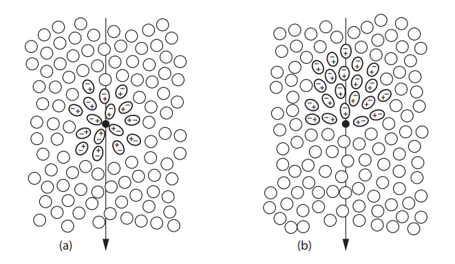
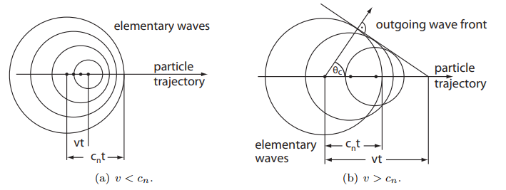
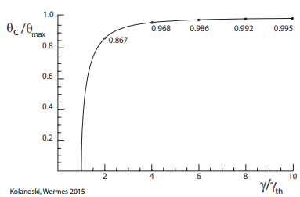
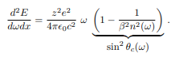
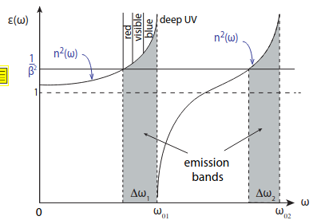
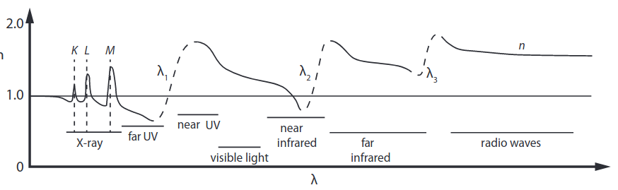
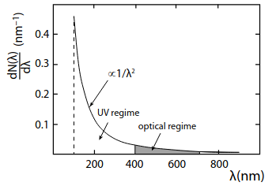
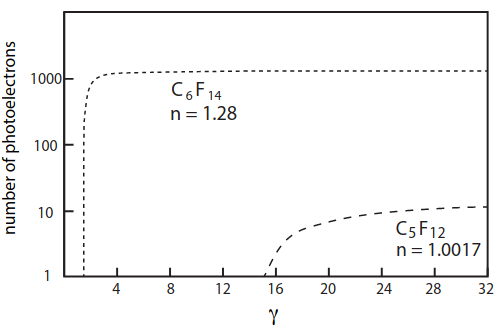
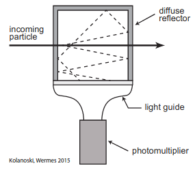
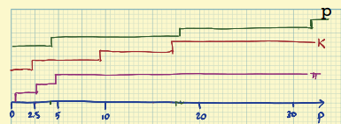

[TOC]

# Rivelatori Cherenkov

## Radiazione Cherenkov 

L'effetto Cherenkov si ha quando una particella attraversa un mezzo con velocità superiore a quella della luce nel mezzo stesso ($c_n=c_0/n$).

La radiazione Cherenkov è causata dalla polarizzazione asimmetrica del mezzo al passaggio della particella che, rilassandosi e tornando all'equilibrio, genera una radiazione di dipolo (questo succede per ogni sezione infinitesima della traccia della particella)

|  |
| :----------------------------------------------------------: |
| A: Una particella a bassa velocità polarizza il mezzo in modo simmetrico |
| B: A velocità superiori a quella della luce nel mezzo la polarizzazione diventa fortemente asimmetrica |

Ogni punto della traccia genera un'onda e se la particella ha $v>c_n$ (con $c_n$ velocità di fase della luce nel mezzo) queste onde interferiscono in modo costruttivo

|  |
| :----------------------------------------------------------: |
| Da questa figura si può ricavare facilmente l'angolo Cherenkov |

L'emissione Cherenkov avviene ad un angolo fissato che aumenta con la velocità della particella
$$
\cos(\theta_C)=\frac{1}{\beta n}
$$

> **NB** Il rinculo causato dall'emissione del fotone è trascurata ma calcoli in QM mostrano che questa approssimazione è valida nella maggior parte dei casi

Questo angolo se misurato può subire uno smearing dovuto alla relazione di dispersione del mezzo che non è costante nella frequenza

**Recap:** La radiazione Cherenkov avviene se:

- La particella ha velocità maggiore alla velocità di fase nel mezzo alla data frequenza di emissione (poichè per relazione di dispersione $n=n(\omega)$)
- Il mezzo è trasparente nell'ottico e ha dimensioni superiori alla linghezza d'onda della radiazione (necessario per permettere l'interferenza costruttiva)

Inoltre, a una distanza sufficiente dalla traccia della particella, le onde hanno polarizzazione trasversa: sono polarizzate linearmente in un piano contenente la direzione di propagazione dell'onda e la traccia della particella

## Cherenkov Threshold

La **velocità minima** per cui si ha emissione Cherenkov si ottiene ponendo $\cos(\theta_C)=1$ (Ovvero emissione in avanti a $0°$)
$$
\beta_\text{th}=\frac{1}{n}
$$
All'aumentare di $\beta$ cresce sia l'angolo che l'intensità dell'emissione.

L'**angolo massimo** invece si ottiene per $\beta=1$
$$
\cos(\theta_\text{max})=\frac{1}{n}
\\
\sin\theta_\text{max}=\sqrt{1-\cos(\theta_\text{max})^2}=\sqrt{1-\frac{1}{n^2}}=\frac{1}{\gamma_\text{th}}
$$

|  |
| :----------------------------------------------------------: |
| Facendo il plot dell'angolo cherenkov normalizzato in funzione del $\gamma$ (normalizzato) si nota come il range di sensibilità di un rivelatore cherenkov è molto stretto dato che oltre una certa velocità la variazione dell'angolo di emissione è quasi nulla. Già a $\gamma=2 \gamma_\text{th}$ l'angolo cherenkov ha raggiunto l'87% del suo valore asintotico $\theta_\text{max}$ |

Con semplici conti è possibile esprimere il seno dell'angolo in funzione di gamma
$$
\sin^2(\theta_C)=\sin^2(\theta_\text{max})\frac{\gamma^2-\gamma_\text{th}^2}{\gamma^2-1} \implies
\\
\implies \lim_{\gamma \to \infty} \frac{\theta_c}{\theta_\text{max}} \simeq \frac{R_c}{R_\text{max}} \simeq \sqrt{1-\frac{\gamma_\text{th}^2}{\gamma^2}}
$$
dove $R_c$ ed $R_\text{max}$ sono i raggi dei rispettivi anelli cherenkov

## Spettro di emissione

|  |
| :----------------------------------------------------------: |
| **Spettro di emissione Cherenkov (Formula di Frank-Tamm)**. Ricordiamo che si ha radiazione Cherenkov solo per $\beta^2 n^2(\omega)>1$ |

> - **Si noti la linearità nella frequenza**
> - Le perdite di energia per luce Cherenkov sono già inluse nella Bethe Bloch ma sono largamente trascurabili: costituiscono meno dell'1% della perdita di energia nei materiali pesanti e possono arrivare al massimo al 5% nei gas leggeri

Un semplice modello per la permittività del mezzo è dato dalla semplice somma sulle sue frequenze di risonanza trascuranto i termini di smorzamento
$$
\epsilon(\omega)=1+\frac{n_ae^2}{\epsilon_0m_e}\sum_i \frac{f_i}{\omega_{0i}^2-\omega^2}
$$
con $n_a$ densità degli atomi e $f_i$ ampiezza relativa alla frequenza di risonanza i-esima con normalizzazione $\sum_i f_i=Z$.

> Ovviamente trattando gli elettroni come oscillatori senza smorzamento si ottiene una divergenza non fisica

Inoltre, per materiali non magnetici ($\mu \sim 1$) vale $n(\omega)\sim\sqrt{\epsilon(\omega)}$
(In realtà $\epsilon$ ha anche una parte immaginaria che causa assorbimento)

|  |
| :----------------------------------------------------------: |
| Poichè l'emissione avviene solo per $n^2>\frac{1}{\beta^2}$ da plot di questo tipo possiamo individuare le bande di frequenze $\Delta \omega_i$ in cui avviene l'emissione |

> *"Fun" fact*
>
> Il fatto che nelle vasche di raffreddamento delle centrali nucleari si veda luce blu è dovuto sia al fatto che lo spettro Cherenkov è più spostato sul blu, sia al fatto che per scattering raylight la luce a frequenza maggiore viene diffusa maggiormente, sia all'assorbimento della luce a più bassa frequenza, sia alla curva di risposta dell'occhio umani

|  |
| :----------------------------------------------------------: |
| Le linee tratteggiate rappresentano le zone di dispersione anomala Per un mezzo reale trasparente nell'ottico sono presenti anche: -  zone a $n<1$ in cui non si può avere emissione.  - Bande di emissione nell'infrarosso e nel radio (e anche a energie quasi discrete nella regione degli X) |

### Spettro dei singoli fotoni

Dividendo la formula di Frank Tamm per l'energia di un singolo fotone $E=\hbar \omega$ si ottiene
$$
\frac{d^2N}{dEdx}= \frac{\alpha}{\hbar c}z^2\left( 1-\frac{1}{\beta^2n^2(\omega)} \right) \xrightarrow{z=1} \; \sim 370 \sin^2(\theta_C)/eV/cm 
$$
con $\alpha=e^2/(4\pi \epsilon_0 \hbar c)$

> NB: questa equazione non ha nulla di quantistico, è stato inserito un $\hbar$ solo perchè si è scelto di raggruppare tutte le costanti con la costante di struttura fine

Usando la relazione $\omega=2\pi c / \lambda$ otteniamo
$$
\frac{d^2N}{d\lambda dx}=\frac{2\pi z^2 \alpha}{\lambda^2}\sin^2(\theta_c(\lambda))
$$

> Quindi lo spettro $\frac{dN}{d\omega}=Const.$ mentre $\frac{dN}{d\lambda}\propto\frac{1}{\lambda^2}$

Integrando su $x$, data L la lunghezza del mezzo, si ha
$$
\frac{dN}{d\lambda}=\frac{2\pi z^2 \alpha}{\lambda^2}L\sin^2(\theta_c(\lambda)) \xrightarrow{\lambda \to \infty}\frac{2\pi z^2 \alpha}{\lambda^2}\frac{L}{\gamma_\text{th}^2}
$$

|  |
| :----------------------------------------------------------: |
| Dipendenza dalla lunghezza d'onda dello spettro cherenkov. Nell'UV c'è un cutoff dovuto alla dispersione anomala del mezzo |

### Photon Yield

Per ottenere il numero di fotoni ottici emessi integriamo lo spettro nella regione ottica.
Assumendo $n$ (e quindi $\theta_c$) costante nella regione ottica abbiamo
$$
N_\text{opt}=z^2L\sin^2(\theta_c)\int_{400nm}^{700nm}\frac{2\pi \alpha}{\lambda^2}d\lambda\simeq z^2L\sin^2(\theta_c) \cdot \left(491 \frac{\text{ photons}}{cm}\right)
$$
Quindi, soprattutto nel caso di indici di rifrazione molto bassi, il numero di fotoni può essere molto basso (spesso ci si ritrova a dover ricostruire anelli con 10 fotoni)

Il numero di **fotoelettroni** dipende anche da T($\lambda$): trasmittanza della finestra del dector, Q($\lambda$): efficienza quantica, R($\lambda$): riflettività degli specchi usati per focalizzare i fotoni sul detector
$$
N_{pe}=2 \pi \alpha z^2 L \sin^2(\theta_c)\int_{\lambda_{1}}^{\lambda_{2}}T(\lambda)\: Q(\lambda) \: R(\lambda) \: \frac{1}{\lambda^2}d\lambda
$$
*L'integrale è chiamato figure of merit e caratterizza totalmente la risposta del detector* 

> Valori tipici per il prodotto delle 3 funzioni di risposta sono intorno al 30% ($Q\sim0.4$ , $T\sim0.8$,  $R\sim1$) quindi solitamente $N_{pe}\sim L \sin^2(\theta_c) \cdot150 (\text{photons}/cm)$

Anche qui è possibile normalizzare il numero di fotoni rispetto il caso asintotico (effettuando l'appossimazione $\sin(\theta_c)\sim \theta_c$)
$$
\frac{N_\gamma}{N_\infty}\sim\frac{\theta_c^2}{\theta^2_\text{max}}\sim1-\frac{\gamma^2_\text{th}}{\gamma^2}
$$

|  |
| :----------------------------------------------------------: |
| Numero di fotoelettroni in funzione di $\gamma$ per diversi materiali con $L=20cm$ e $ Q \cdot T \cdot R \sim 0.35$ |

## Tipi di detector Cherenkov

L'effetto cherenkov può essere sfruttato in diversi modi:

- Threshold: seleziona solo particelle al di sopra di una certa velocità
- Time of Flight
- Particle identification
- Misura di $\beta$ (e se impulso noto da altri detector anche massa)

### Threshold

In questi detector non viene misurato l'angolo Cherenkov e si ha solo una risposta si/no.

L'impulso di soglia è $p_\text{th}=mc^2(\beta \gamma)_\text{th}=\frac{mc^2}{\sqrt{n^2-1}}$
Se il momento è noto da altri detector (spesso sfruttando un cambo magnetico) si  può usare il detector cherenkov come soglia sulla massa $m_{th}c^2=p\sqrt{n^2-1}$

> Spesso come mezzo viene usato un gas in quanto è possibile modificare $n$, e quindi la soglia, al variare della pressione del gas

Se vogliamo osservare un range di energia troppo grande conviene usare più detector in successione con threshold crescente in modo tale che i detector si "accendono" in sequenza e misurando l'impulso è possibile fare **PID**

|  |
| :----------------------------------------------------------: |
| Particle identification con 3 detector Cherenkov a threshold |

#### Risoluzione di un threshold detector

Volendo si può fare particle identification con questi detector misurando il numero di fotoni emessi.

L'incertezza legata al numero di fotoni è
 $\sigma_N=\frac{\partial N}{\partial \theta_c}\sigma_{\theta_c}=\frac{2N}{\tan(\theta_c)}\sigma_{\theta_c}= \sqrt{N}$ dove $\sigma(\theta_c)$ è lo spread angolare che varia con $\beta$

> - Dopo quella derivata si è moltiplicato e diviso per $\sin(\theta_c)$ per riscrivere il numero di fotoelettroni e la tangente
> - $\sigma_N=\sqrt{N}$ poichè statistica sui conteggi è poissoniana
> - **NB:** $\theta_c$ non viene misurato nei threshold counter

La risoluzione su $\beta$ invece è  (usando $\beta=1/(n \cos(\theta_c))$)
$\sigma_\beta=\frac{\partial \beta}{\partial \theta_c} \; \sigma_{\theta_c}=\beta \tan(\theta_c)$

Quindi mettendo tutto insieme si tronva $\frac{\sigma_\beta}{\beta}=\frac{\tan^2(\theta_c)}{1\sqrt{N}}$

### RICH (Ring imaging Cherenkov detector)

# Transition radiation detectors

# PID Methods

