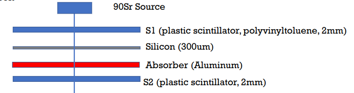

# Basics of detector technologies

## Interazione radiazione materia

### 

Data una sorgente di $Sr^{90}$ si vuole misurare il comportamento degli $e^-$ emessi al MIP con un detector di silicio spesso 300$\mu m$. 
Per farlo bisogna scartare la parte bassa dello spettro con un sistema di coincidenze.

1. Qual è l'energia degli $e^-$ usciti dal detector di silicio?
2. Quanto deve essere spesso l'assorbitore di allumio per fermare gli $e^-$ meno energetici?

**Soluzione**: (tutti i dati presi dal MNIST)

- Sr90 decade doppio $\beta^-$ con energie 0.5 MeV e 2.28MeV
- Densità alluminio 2.27 $g/cm^3$
- Densità silicio 3.74 $g/cm^3$

1. Per il silicio l'energia critica è 40MeV quindi le perdite sono per ionizzazione e nel range 0.3-3MeV il $dE/dx$ può essere considerato costante con un valore di 

   $-\frac{1}{\rho} \frac{dE}{dx}\sim 1.6 MeV cm^2 /g \implies -\frac{dE}{dx}\sim0.6 KeV/ \mu m$

   Quindi l'energia dei $\gamma$ uscenti sarà (semplicemnte moltiplicando per lo spessore del silicio ) 0.320 MeV e 2.1 MeV

2. L'alluminio deve fermare elettroni da 320KeV.
   A 350KeV il range degli elettroni nell'alluminio è $\rho R=1.361 g/cm^2\implies R\sim 0.6cm$ 
   Quindi sono necessari 0.6cm di alluminio.

### 

Dato un pione con impulso 100GeV (neutro e carico) prodotto tramite una collisione a targhetta fissa stima lo spessore di un blocco di cemento dale che sia in grado di:

1. Bloccare pioni carichi
2. Bloccare fotoni dal decadimento del $\pi_0$
3. Muoni dal decadimento del pione carico

Discuti i meccanismi dominanti per i 3 casi.

**Soluzione**:

- densità cemento: $2.4 g/cm^3$

1. Per la ionizzazione ci si può riferire alle tabelle per muoni tenendo conto che $p_\pi=p_\mu \frac{m_\pi}{m_\mu}\implies p_\mu=p_\pi/1.4 \sim 71 GeV$

   L'effetto elettromagnetico dominante è per **ionizzazione** e, a 100 GeV, si ha un range di $\rho R=4.03\cdot 10^{4} g/cm^2\implies R\sim 167 m$ 

   Per **interazioni adroniche** invece la lunghezza di interazione (solo processi inelastici), è di 56 cm. 
   Se abbiamo un facio di pioni per assorbire il 95% di essi abbiamo bisogno di $N=N_0e^{-x/\lambda}=N_0*0.05 \implies x=-\lambda\ln(0.05)\sim1.5m$

2. Nel sdr del cdm il $\pi_0$ emette due fotoni a circa 70MeV.
   Facendo il boost nel caso di fotone collineare (massima energia possibile del fotone) si ha $E_\gamma = k\gamma_\pi(1+\beta_\pi)=k(\gamma_\pi +\frac{p_\pi}{m_\pi})$

   noltre $\gamma_\pi=\frac{E_\pi}{m_\pi}=\sqrt{1+\frac{p_\pi^2}{m_\pi^2}}$ quindi si ha tutto in funzione di $p/m=100GeV/140MeV \sim 700$.

   Quindi $E_\gamma \sim 2 k p_\pi/m_\pi\sim 98 GeV$

   Per un fotone d circa 100GeV è dominante la produzione di coppie che nel cemento ha coefficiente di assorbimento $\mu /\rho=0.02 cm^2/g \implies \mu \sim 0.05 cm^{-1}$

   Come prima, per attenuare un fascio di fotoni di 98 GeV è necessatrio uno spessore di $x=-\ln(0.05)/\mu\sim 60cm$

3. Il pione carico decade in muone e neutrino.

   Troviamo l'impulso del muone nel cdm

   $(p_\pi-k)^2=p_\mu^2=m_\mu^2\implies k=p_\mu=\frac{m_\pi^2-m_\mu^2}{2p_\pi}\sim 48KeV $

   Facendo il boost come prima, dato un rapporto $p_\pi/m_\pi \sim 700$ si ha

   $\beta_\mu \gamma_\mu=(\frac{p_\pi}{m_\pi}\sqrt{m_\mu^2+p_\mu^2}+p_\mu\sqrt{1+p_\pi^2/m_\pi^2})/m_\mu\sim\frac{p_\pi}{m_\pi}\frac{p_\mu+m_\mu}{m_\mu}\sim 735 \implies \\ p_\mu \sim 74 GeV$

   Andando a vedere il valore del range nel cemento per questo impulso si ha che il cemento deve essere spesso $3.3\cdot 10^{4} g/cm^2 \implies R\sim 137m$

   

## Formazione del segnale

