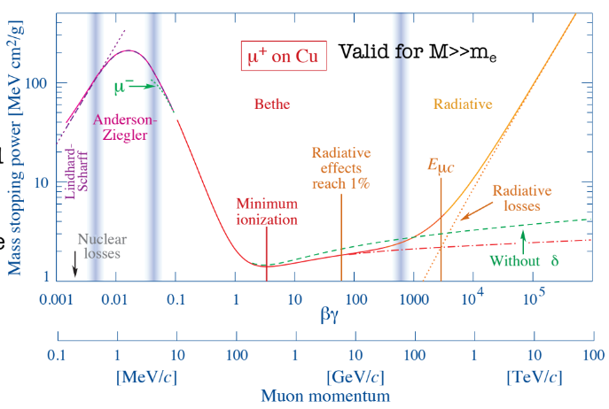
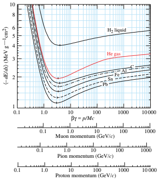
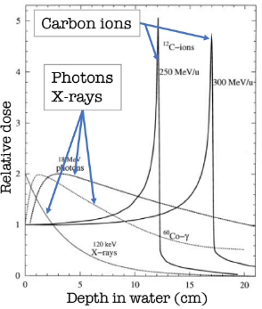

[TOC]

## CHIEDI A FORTI o controlla

- Lunghezza di radiazione per particelle diverse da elettroni (su pdg sta scritto insensato)
- Per stimare energia persa usare moda o mediana della landau?
- Cherenkov incluso nella bethe bloch?

## SISTEMA

- Vedi come impostare snippets, metti BB=beta GG=\gamma FF=\frac{}{}, ^=^{} , \_=\_{}  
- Aggiungi plugin per newpage in pdf

# Introduzione

|  |
| ------------------------------------------------------------ |
| Unità usate in HEP                                           |

Aggiungi massa particelle più importanti

Aggiungi dati su materiali più importanti

Aggiungi info utili da pdg man mano che fai esercizi

# Interazione radiazione materia

Il tempo tipico di decadimento delle particelle dipende dal tipo di interazione:

- Forte  < $10^{-22}s$
- Debole > $10^{-13}s$
- EM $10^{-20}-10^{-14}s$

La lunghezza percorsa da una particella prima di decadere è $l=\beta \gamma c \tau_0$ quindi possono essere misurate direttamente protoni, neutroni, elettroni,neutrini (elusivi) e muoni. I $\pi$ e i K possono essere rivelati direttamente ma anche decadere nel rivelatore.

**Proprietà misurabili**:

- **Momento**: per particelle cariche misurabile tramite il raggio di curvatura in campo magnetico $$p=qRB$$ (R ha un segno per essere consistente con la direzione e con la carica)
- **Carica**: Dirzione della deflessione in campo magnetico
- **Energia**: Misurabile tramite la carica rilasciata o la luce prodotta in un calorimetro
- **Tempo di vita**: Ricostruendo il vertice del decadimento (geometricamente) si può ricavare il tempo in cui è decaduta
- **Velocità**: Tramite TOF, angolo Cherenkov o dal $\frac{dE}{dx}$ 
- **Massa**: Ottenibile da $m^2=E^2-p^2$ o da $p=m\beta/\sqrt{1-\beta^2} $

## Interazione di particelle cariche

I meccanismi di interazione principali per le particelle cariche sono:

- **Eccitazione/Ionizzazione**: Un atomo viene ionizzato rilasciando un $e^-$ poi collezionato per formare un segnale o viene prodotta luce tramite de eccitazione

- **Bremstrahlung**: Particella che viene deflessa dal campo EM nucleare e irraggia (*significativa solo per $e^+$ ed $e^{-}$: particelle leggere*)

- **Cherenkov**: Onda d'urto EM prodotta da particelle veloci

- **Radiazione di transizione**: Radiazione emessa quando una particella attraversa un mezzo con indice di rifrazione discontinuo (es. separazione tra vuoto e dielettrico). Questo accade perchè il campo elettrico longitudinale subisce un brusco riarrangiamento che ,in situazioni di energie molto alte, causa irraggiamento

  L'intensità della radiazione è $\propto \gamma$ quindi può essere usata per misurare velocità

### Particelle massive

#### Stopping power

Lo stopping power è definito come il $-dE/dx$ per unità di densità del materiale quindi è misurata in $MeV cm^2/g$  ed è espresso in funzione di $\beta \gamma=p/m$.

Queste curve, se non normalizzate per la massa della particella, possono essere utili per fare particle identification poichè ogni particella segue una curva a se

|  |
| ------------------------------------------------------------ |
| Plot dello stopping power **per particelle con $M>>m_e$** . Per elettroni e positroni domina Bremstrahlung.  Possiamo distinguere 3 zone :  zona di scattering elastico, di ionizzazione e di Bremstrahlung |

Analizziamo le diverse regioni della curva:

- Nella zona a più bassa energia (Lindhard-Scharff) si ha un andamento $\propto \beta$ dovuto a scattering elastico su nuclei

- La zona di Anderson-Ziegler è ottenuta empiricamente tramite fit su dati sperimentali per mettere un raccordo tra i modelli

  In questa zona si ha l' **effetto Barkas** che consiste in un minore stopping power per particelle negative (dovuto a fattori correttivi di ordine successivo)

- Nella zona di ionizzazione a basse energie si ha un andamento dominato da un fattore cinematico $\sim \beta^{-5/3} \sim \beta^{-2}$ 

  In questa zona la curva è molto sensibile a variazioni di $\beta$ quindi è possibile ricavare la velocità misurando il $dE/dx$

- A circa 3 - 4$\beta \gamma$ si ha il minimo di ionizzazione ed è $\sim 1-2 MeV cm^2/g$

- Dopo il minimo di ionizzazione si ha una risalita $\propto ln(\beta \gamma)^2$ dovuta all'estensione relativistica del campo elettrico trasversale ma per grandi $\beta \gamma$ il dielettrico viene polarizzato e si ha una saturazione (*effetto del $\delta$*)

- Al di sopra dell' **energia critica** dominano le perdite radiative ovvero la Bremstrahlung e altri processi minori

Concentriamoci un attimo sulle perdite per **ionizzazione**

|  |
| ------------------------------------------------------------ |
| Bethe-Block: dE/dx dovuta unicamente alla ionizzazione (zona centrale dello stopping power) (e alla radiazione Cherenkov). Non include nè le perdite per bremstrahlung (dominante ad alte energie) nè le perdite per radiazione di transizione |

|  |
| ------------------------------------------------------------ |
| A: Possiamo vedere come le curve sono essenzialmente indipendenti dal materiale salvo per l'idrogeno. Ricorda che sono normalizzate per la densità |
| B: Qui è possibile vedere meglio l'effetto del termine $\delta$ e della dipendenza logaritmica |

Alcune osservazioni sulla Bethe-Block (ionizzazione):

- il fattore Z/A, per la formula semiempirica di massa, è più o meno sempre lo stesso $Z/A\sim 0.4$ tranne che per l'idrogeno $H_2$ dove è 1 (poichè non ha neutroni)
- A basse energie domina andamento $\sim \beta^{-2}$. 
- La curva poi risale per 2 motivi: 
  1. La massima energia trasferibile aumenta con $ \gamma$ (effetto cinematico)
  2. Il campo elettrico trasversale subisce un estensione per effetti relativistici anche se limitato dallo screening degli elettroni atomici che vengono polarizzati (termine $\delta$)

#### Picco di Bragg

Per particelle massive con momenti molto bassi si può osservare il picco di Bragg

| La dose non è altro che E/M |
| :----------------------------------------------------------- |
| Man mano che la particella perde energia lo stopping power aumenta. E' possibile ricostruire l'energia persa in funzione della penetrazione usando l'andamento $\beta^{-2}$ valido a basse energie |

#### Elettroni delta

Per trasferimenti di energia elevati possono essere strappati elettroni atomici che creano tracce secondarie (sufficientemente lunghe) nella stessa direzione della particella incidente (o comunque a piccoli angoli).

Se il detector non riesce a trattare adeguatamente questi elettroni si può avere un peggioramento della risoluzione spaziale (poichè la carica viene depositata più lontano dal punto di interazione) e fluttuazioni più grandi dello stopping power

#### Range

Il range è la lunghezza percorsa dalla particella nel materiale $R=\int_{T_0}^0 (\frac{dE}{dx})^{-1} dT$ dove $T_0$ è l'energia cinetica iniziale della particella.

|  |
| :----------------------------------------------------------: |

Quando sono coinvolti fenomeni di assorbimento il numero di particelle decresce esponenzialmente (fotoni).

Quando sono coinvolte particelle cariche il numero di particelle rimane pressocchè costante. In figura si vede una lieve diminuzione dovuta a interazioni nucleari.

Si nota anche che il $dN/dx$​ non è una delta ma ha una sua larghezza chiamata **straggling** : questo fenomeno è dovuto alle fluttuazioni statistiche dell'energia rilasciata nel materiale (vedi più avanti)

|  |
| :----------------------------------------------------------: |
| Range normalizzato per la densità del materiale in funzione di $\beta \gamma$ . Plot utile per capire quanto materiale usare in un esperimento |

Se si esprime l'integrale del range in funzione di $\gamma$ si ha $R=\frac{M}{z^2}f(\gamma_0)$ dove $\gamma_0$ è il $\gamma$ iniziale della particella e $f(\gamma_0)$ è una funzione indipendente dalle proprietà della particella (massa e carica) e dipende solo dal materiale. Quindi il range scala come $M/z^2$ (riferite alla particella)

### Particelle poco massive ($e^-$ ed $e^+$)

Per le particelle cariche poco massive (elettroni e positroni) vale quanto detto sopra ma sono presenti dei fenomeni aggiuntivi: 

- La **bremstrahlug**  
- Gli elettroni incidenti scatterano con elettroni atomici: Sono particelle identiche, interviene il principio di pauli
- Per positroni va considerata l'annichilazione con gli elettroni atomici

Generalmente, oltre a prendere in considerazione la bremstrahlung, vanno considerati 2 regimi di energia:

- Quando i livelli energetici degli elettroni atomici NON possono essere trascurati si fa la media come nel caso di particelle massive
- Quando si hanno grandi trasferimenti di energia vengono considerati gli scattering Moller ($e^- e^- \to e^- e^-$) e Bhabha ($e^+ e^- \to e^+ e^-$)  

|  |
| ------------------------------------------------------------ |
| Per particelle leggere il dE/dx è molto diverso in quanto la bremmstrahlung diventa dominante già sotto il GeV, nel piombo già a 7MeV  Anche qui si nota l'effetto per il quale la particella con carica negativa a basse energie perde un po' meno energia |

#### Bremstrahlung e lunghezza di radiazione

Consiste nell'irragiamento dovuto alla deflessione dell'elettrone causata dal campo elettrico nucleare (scattering Rutherford con il nucleo)

L'energia emessa per una carica accelerata, sia nel limite classico che quantistico, è $dE/dt \propto \frac{1}{m^2}$

> **NB** Ad altissime energie (es. LHC) la bremmstrahlung diventa rilevante anche per muoni e pioni

$$
-\frac{dE}{dX}|_{\text{Brem.}}= \frac{E}{X_0} \implies
\\
\implies E(x)=E_0 e^{-x/X_0}
$$

|  |
| :----------------------------------------------------------: |
| $X_0$ è chiamata **lunchezza di radiazione** e corrispone alla lunghezza dopo il quale l'energia di un **elettrone** è ridotta di un frattore $1/e$ (per bremmstrahlung) |
| **NB** La lungheza di radiazione è definita solo per elettroni in quanto per altre particelle molto energetiche come muoni le fluttuazioni di energia sono molto grandi e spesso sono associate a sciamature quindi parlare di perdita di energia come un processo uniforme e continuo è insensato |

Inoltre quando avviene Bremmstrahlung dobbiamo considerare vari possibili fenomeni:

- Correzioni di Coulomb: Correzione dovuta all'interferenza della funzione d'onda della particella con il campo coulombiano

- Suppressione dielettrica: Fotoni emessi a piccole energie vengono assorbiti nel materiali a causa della polarizzabilità del materiale causando una perdita di coerenza e un cutoff infrarosso nello spettro del fotone

- La bremmstrahlung può avvenire anche con il campo elettrico degli elettroni atomici (basta sostituzione $Z^2 \to Z(Z+1)$)

- Effetto LPM: Ad altissime energie (sopra il TeV) la Bremmstrahlung (e la produzione di coppie) è soppressa .

  Ad alte energie per energie perse piccole l'interazzione avviene su lunghe distanze. Se questa distanza è maggiore del cammino libero medio (distanza media tra 2 eventi successivi) la prima emissione interferisce con la seconda introducendo causando una soppressione nello spettro dei fotoni

###  Fluttuazioni statistiche

La Bethe block determina solo il $dE/dx$ medio ma in realtà l'energia rilasciata è soggetta a fluttuazioni.

L'energia persa $\Delta E$ in un tratto $\Delta x$ è la somma di tutti i processi di eccitazione/ionizzazione lungo il tratto percorso $\Delta E= \sum^N_{n=1} \delta E_n$.
Ci sono 2 contributi statistici:

- Uno dovuto al numero di ionizzazioni/eccitazioni (conteggio)
- Uno dovuto all'energia emessa dal processo

Queste fluttuazioni possono causare una serie di problemi

- **Incertezza sul momento**:Per ricostruire il momento di una particella solitamente si usa la Bethe Block per capire quanta energia ha perso nel detector ma le fluttuazioni statistiche introducono un'incertezza sull'energia persa e quindi anche sul momento
- **Incertezze nel PID** poichè la particle identification si fa soprattutto tramite le misure del $$dE/dx$$ è introdotta un incertezza anche su questo
- **Incertezze nel tracking**: I tracker sono solitamente sottili quindi soffrono delle fluttuazioni poissoniane. Inoltre la risoluzione spaziale è ulteriormente ridotta dagli elettroni delta che possono anche causare ionizzazioni secontarie

#### Fluttuazioni del numero di processi

E' una fluttuazione di tipo **Poissoniano**, rilevante soprattutto in detector sottili (molto usati nel tracking) e l'incertezza relativa è 
$$
\frac{\sigma(\Delta E)}{\Delta E}\sim\frac{1}{\sqrt{N}}
$$

> In caso di rivelatore spesso 1cm di Argon questa incertezza è del 10%
>
> I rivelatori a semiconduttore invece necessitano energie molto più basse per produrre una coppia elettrone lacuna quindi vengono creati molti più elettroni e l'incertezza è molto ridotta rispetto i rilevatori a gas

#### Fluttuazioni nell'energia rilasciata

Dalla distribuzione angolare degli elettroni emessi nel processo di ionizzazione si trova che tra un valore $\delta E_{min}$ (dato dall'energia di ionizzazione dell'atome) e un valore $\delta E_{max}$ (dato da constraint cinematici) la distribuzione di $\delta E$ ha un andamento $\sim 1/(\delta E)^2$ .

Il massimo della distribuzione si ha intorno a $\delta E_{min}$ ma ricordiamo che per energie più alte si presenta il problema degli elettroni delta 

#### Distribuzione di Landau-Vavilov

Generalmente le fluttuazioni nell'energia rilasciata portano a una distibuzione asimmetrica composta da una parte gaussiana (dovuta a piccole perdite di energia) e una lunga coda (per grandi perdite di energia)

> **NB :** A causa dell'asimmetria della distribuzione il valore più probabile di energia rilasciata NON è quello che vediamo nella Bethe Block (che è la media) che è un po' più alto della moda della distribuzione

Il primo a trovare una distribuzione fu **Landau** sotto le seguenti ipotesi:

- $lim_{k \to0} T_{max}= +\infty$
- Gli elettroni sono trattati come quasi liberi, sono trascurati gli effetti di legame per bassi valori dell'energia trasferita
- La perdita di energia della particella nel mezzo può essere trascurata

$$
f_L(\lambda)=\frac{1}{\pi}\int_0^\infty e^{-t ln (t)-\lambda t }\sin (\pi t) dt
\\
\;\;\lambda=\frac{\Delta E -\Delta E_w}{\xi} \;\;
\\
\;\;\Delta E_w=\text{Massimo della distr.}
$$

La forma della distribuzione dipende dal parametro $k=\xi/T_{max}$ dove $T_{max}$ è l'energia cinetica massima cedibile a un elettrone e $\xi \propto \rho\frac{Z}{A}\frac{z^2}{\beta^2} \Delta x$  è il fattore moltiplicativo presente nella bethe block quindi essezialmente $\xi \simeq dE/dx$ (almeno concettualmente, nell'andamento)

- **k grande** implica **distribuzione simmetrica (Gaussiana)**
- **k piccolo** implica **distribuzione asimmetrica**

La distribuzione di landau è un'ottima **approssimazione per piccoli valori di k**

|  |
| :----------------------------------------------------------: |
| Distribuzione di Landau. Il $\Delta \lambda$ è la larghezza a metà altezza |

> La landau può essere approssiamata dalla distribuzione di Moyal $f(\lambda)=\frac{1}{\sqrt{2\pi}}e^{-0.5(\lambda+e^{-\lambda})}$ 
> In questo caso però $\lambda$ perde il senso fisico che ha nella landau per questo è preferibile usare la Landau

**Vavilov** generalizzò la distribuzione anche per grandi valori di k ma comunque mantenendo l'assunzione che gli effetti di legame siano trascurabili per piccoli davoli di energia trasferita.
Questa distribuzione ha 2 parametri aggiuntivi rispetto alla distribuzione di Landau

> Senza entrare nel dettaglio la Vavilov è definita tramite una trasformata di Laplace

#### Soppressione delle fluttuazioni

La fluttuazioni possono essere ridotte se la moda della distribuzione può essere usata come uno stimatore dell'energia persa al posto della media poichè la moda gode di uno stimatore migliore (La distribuzione ha una coda molto lunga quindi la media aritmetica potrebbe avere una varianza molto grande rispetto alla moda soprattutto ad alte energie)

|  |
| :----------------------------------------------------------: |
| Le curve tratteggiate sono relative alla moda invece che alla media. Si nota che ad alte energie la media sale molto di più rispetto alla moda |

Altri metrodi per eliminare incertezze sono:

- Escludere gli elettroni deltra dalle misurse (Possibile in cloud/bubble chamber e in layer indipendenti molto sottili di un detector)
- Usare una media troncata scartando i valori più alti e più bassi (Stima più robusta)
- Ricostruire l'energia persa dalla particella durante il suo percorso e non solo alla fine (Utile nella misura del momento.)

### Multiplo scattering

In un materiale possono avvenire scattering multipli. Questi causano un'incertezza nella direzione della particella.
La distribuzione angolare dell'angolo di scattering medio può essere ben approssimata  con una gaussiana (per limite centrale)

>
> per un numero finito e fissato di scattering c'è distribuzione di Moliere che però predice probabilità più alte per grandi angoli come Rutherford

|  |
| :----------------------------------------------------------: |
| Deviazione standard dell'angolo di scattering nell'approssimazione gaussiana a piccoli angoli (valida al di sopra dei 20MeV) |

### Radiazione Cherenkov

La radiazione Cherenkov avviene quando una particella carica attraversa un mezzo a una velocità maggiore della velocità della luce nello stesso mezzo causando un'onda d'urto luminosa.

Quello che viene prodotto è un cono luminoso con una apertura angolare di $\cos(\theta_c)=\frac{1}{n\beta}$ , questo significa che la luce cherenkov può essere usata per trovare $\beta$ o come threshold in quanto viene emessa solo per $\beta>1/n$

L'energia persa per radiazione cherenkov è solitamente molto bassa e trascurabile (Comunque inclusa nella bethe bloch nelle perdite radiative)

## Interazione di fotoni

## Interazioni adroniche

## Interazione di neutrini

# Formazione del segnale

